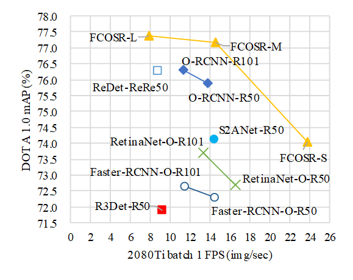

# FCOSR: A Simple Anchor-free Rotated Detector for Aerial Object Detection

> **[FCOSR: A Simple Anchor-free Rotated Detector for Aerial Object Detection](#)** 
> arXiv preprint ([arXiv:2111.10780](https://arxiv.org/abs/2111.10780)).

This implement is modified from [mmdetection](https://github.com/open-mmlab/mmdetection). 
We also refer to the codes of 
[ReDet](https://github.com/csuhan/ReDet), 
[PIoU](https://github.com/clobotics/piou), 
and [ProbIoU](https://github.com/ProbIOU/probiou-sample).

In the process of implementation, 
we find that only Python code processing will produce huge memory overhead on Nvidia devices.
Therefore, we directly write the label assignment module proposed in this paper in the form of CUDA extension of Pytorch.
The program could not work effectively when we migrate it to cuda 11 (only support cuda10).
By applying CUDA expansion, the memory utilization is improved and a lot of unnecessary calculations are reduced.
We also try to train FCOSR-M on 2080ti (4 images per device), which can basically fill memory of graphics card.

FCOSR TensorRT inference code is available at: [https://github.com/lzh420202/FCOSR_TensorRT_Inference]() 
祝大家12月26日,"圣诞快乐".

## Install

Please refer to [install.md](./install.md) for installation and dataset preparation.

## Getting Started

Please see [get_started.md](./get_started.md) for the basic usage.

## Model Zoo

### Speed vs Accuracy on DOTA 1.0 test set

Details (Test device: nvidia RTX 2080ti)

|Methods|backbone|FPS|mAP(%)|
|-|-|-|-|
|[ReDet](https://github.com/csuhan/ReDet)|ReR50|8.8|76.25|
|[S2ANet](https://github.com/csuhan/s2anet)|R50|14.4|74.14|
|[R3Det](https://github.com/SJTU-Thinklab-Det/r3det-on-mmdetection)|R50|9.2|71.9|
|[Oriented-RCNN](https://github.com/jbwang1997/OBBDetection)|R50|13.8|75.87|
|[Oriented-RCNN](https://github.com/jbwang1997/OBBDetection)|R101|11.3|76.28|
|[RetinaNet-O](https://github.com/jbwang1997/OBBDetection)|R50|16.5|72.7|
|[RetinaNet-O](https://github.com/jbwang1997/OBBDetection)|R101|13.3|73.7|
|[Faster-RCNN-O](https://github.com/jbwang1997/OBBDetection)|R50|14.4|72.29|
|[Faster-RCNN-O](https://github.com/jbwang1997/OBBDetection)|R101|11.4|72.65|
|FCOSR-S|Mobilenet v2|23.7|74.05|
|FCOSR-M|Rx50|14.6|77.15|
|FCOSR-L|Rx101|7.9|77.39|

**The password of baiduPan is ABCD**

### FCOSR serise DOTA 1.0 result.FPS(2080ti) [Detail](./Details.md#fcosr-serise-dota-10-result)

|Model|backbone|MS|Sched.|Param.|Input|GFLOPs|FPS|mAP|download|
|:-|:-|:-:|:-:|:-:|:-:|:-:|:-:|:-:|:-:|
|FCOSR-S|Mobilenet v2|-|3x|7.32M|1024×1024|101.42|23.7|74.05|[model](https://pan.baidu.com/s/1kYN7oE2I8naX2zVQo02iWQ)/[cfg](configs/fcosrbox/fcosr_mobilenetv2_fpn_3x_dota10_single.py)|
|FCOSR-S|Mobilenet v2|✓|3x|7.32M|1024×1024|101.42|23.7|76.11|[model](https://pan.baidu.com/s/1hbYZmNU8WXG_EmlpgpkQ3A)/[cfg](configs/fcosrbox/fcosr_mobilenetv2_fpn_3x_dota10_ms.py)|
|FCOSR-M|ResNext50-32x4|-|3x|31.4M|1024×1024|210.01|14.6|77.15|[model](https://pan.baidu.com/s/1HItBizh5FpxGdwWzONloRw)/[cfg](configs/fcosrbox/fcosr_rx50_32x4d_fpn_3x_dota10_single.py)|
|FCOSR-M|ResNext50-32x4|✓|3x|31.4M|1024×1024|210.01|14.6|79.25|[model](https://pan.baidu.com/s/1J1ZrLyj8XI7rU0M9ULF5Bg)/[cfg](configs/fcosrbox/fcosr_rx50_32x4d_fpn_3x_dota10_ms.py)|
|FCOSR-L|ResNext101-64x4|-|3x|89.64M|1024×1024|445.75|7.9|77.39|[model](https://pan.baidu.com/s/1W0c-2_xKpg5DogqlBgcU9w)/[cfg](configs/fcosrbox/fcosr_rx101_64x4d_fpn_3x_dota10_single.py)|
|FCOSR-L|ResNext101-64x4|✓|3x|89.64M|1024×1024|445.75|7.9|78.80|[model](https://pan.baidu.com/s/1WK48mkbHBYgF7gfvh45g9g)/[cfg](configs/fcosrbox/fcosr_rx101_64x4d_fpn_3x_dota10_ms.py)|

### FCOSR serise DOTA 1.5 result. FPS(2080ti) [Detail](./Details.md#fcosr-serise-dota-15-result)

|Model|backbone|MS|Sched.|Param.|Input|GFLOPs|FPS|mAP|download|
|:-|:-|:-:|:-:|:-:|:-:|:-:|:-:|:-:|:-:|
|FCOSR-S|Mobilenet v2|-|3x|7.32M|1024×1024|101.42|23.7|66.37|[model](https://pan.baidu.com/s/1qcW_DFF0mMrx4YzrCKTSOw)/[cfg](configs/fcosrbox/fcosr_mobilenetv2_fpn_3x_dota15_single.py)|
|FCOSR-S|Mobilenet v2|✓|3x|7.32M|1024×1024|101.42|23.7|73.14|[model](https://pan.baidu.com/s/1R2vW6tAKd091btm566nPRQ)/[cfg](configs/fcosrbox/fcosr_mobilenetv2_fpn_3x_dota15_ms.py)|
|FCOSR-M|ResNext50-32x4|-|3x|31.4M|1024×1024|210.01|14.6|68.74|[model](https://pan.baidu.com/s/1BC7pSmzA9y1n2sExIP__dw)/[cfg](configs/fcosrbox/fcosr_rx50_32x4d_fpn_3x_dota15_single.py)|
|FCOSR-M|ResNext50-32x4|✓|3x|31.4M|1024×1024|210.01|14.6|73.79|[model](https://pan.baidu.com/s/1ubCywgEoH-hssptVDAipyQ)/[cfg](configs/fcosrbox/fcosr_rx50_32x4d_fpn_3x_dota15_ms.py)|
|FCOSR-L|ResNext101-64x4|-|3x|89.64M|1024×1024|445.75|7.9|69.96|[model](https://pan.baidu.com/s/1__vt9AII-6SqxR8UU5VxlA)/[cfg](configs/fcosrbox/fcosr_rx101_64x4d_fpn_3x_dota15_single.py)|
|FCOSR-L|ResNext101-64x4|✓|3x|89.64M|1024×1024|445.75|7.9|75.41|[model](https://pan.baidu.com/s/1bFzKSpJDnVh3tu3By-YHGA)/[cfg](configs/fcosrbox/fcosr_rx101_64x4d_fpn_3x_dota15_ms.py)|

### FCOSR serise HRSC2016 result. FPS(2080ti)

|Model|backbone|Rot.|Sched.|Param.|Input|GFLOPs|FPS|AP50(07)|AP75(07)|AP50(12)|AP75(12)|download|
|:-|:-|:-:|:-:|:-:|:-:|:-:|:-:|:-:|:-:|:-:|:-:|:-:|
|FCOSR-S|Mobilenet v2|✓|40k iters|7.29M|800×800|61.57|35.3|90.08|76.75|92.67|75.73|[model](https://pan.baidu.com/s/1HhJITM3jRCtFzAhGc7lv3Q)/[cfg](configs/fcosrbox/fcosr_mobilenetv2_fpn_40k_hrsc2016.py)|
|FCOSR-M|ResNext50-32x4|✓|40k iters|31.37M|800×800|127.87|26.9|90.15|78.58|94.84|81.38|[model](https://pan.baidu.com/s/1_aXC_IO9XT9ygwwvUZW1fw)/[cfg](configs/fcosrbox/fcosr_rx50_32x4d_fpn_40k_hrsc2016.py)|
|FCOSR-L|ResNext101-64x4|✓|40k iters|89.61M|800×800|271.75|15.1|90.14|77.98|95.74|80.94|[model](https://pan.baidu.com/s/16u940TyDTewCd4KvDkc1GA)/[cfg](configs/fcosrbox/fcosr_rx101_64x4d_fpn_40k_hrsc2016.py)|

### Lightweight FCOSR test result on Jetson Xavier NX (DOTA 1.0 single-scale). [Detail](./Details.md#lightweight-fcosr-test-result-on-jetson-xavier-nx-dota-10-single-scale)

|Model|backbone|Head channels|Sched.|Param|Size|Input|GFLOPs|FPS|mAP|onnx|TensorRT|
|:-|:-|:-:|:-:|:-:|:-:|:-:|:-:|:-:|:-:|:-:|:-:|
|FCOSR-lite|Mobilenet v2|256|3x|6.9M|51.63MB|1024×1024|101.25|7.64|74.30|[onnx](https://pan.baidu.com/s/1jsNzc_ivr0THC9EWhw2Bkw)|[trt](https://pan.baidu.com/s/1Bhg3hfJJlc2-iJBPi79zFA)|
|FCOSR-tiny|Mobilenet v2|128|3x|3.52M|23.2MB|1024×1024|35.89|10.68|73.93|[onnx](https://pan.baidu.com/s/1m_QUYhStewEB-dpPYA0igA)|[trt](https://pan.baidu.com/s/1WPLV7xjXkMLSes5Jf8cFgw)|

### Lightweight FCOSR test result on Jetson AGX Xavier (DOTA 1.0 single-scale).

A part of Dota1.0 dataset (whole image mode) [**Code**](https://github.com/lzh420202/FCOSR_TensorRT_Inference)

|name|size|patch size|gap|patches|det objects|det time(s)|
|-|-|-|-|-|-|-|
|P0031.png|5343×3795|1024|200|35|1197|2.75|
|P0051.png|4672×5430|1024|200|42|309|2.38|
|P0112.png|6989×4516|1024|200|54|184|3.02|
|P0137.png|5276×4308|1024|200|35|66|1.95|
|P1004.png|7001×3907|1024|200|45|183|2.52|
|P1125.png|7582×4333|1024|200|54|28|2.95|
|P1129.png|4093×6529|1024|200|40|70|2.23|
|P1146.png|5231×4616|1024|200|42|64|2.29|
|P1157.png|7278×5286|1024|200|63|184|3.47|
|P1378.png|5445×4561|1024|200|42|83|2.32|
|P1379.png|4426×4182|1024|200|30|686|1.78|
|P1393.png|6072×6540|1024|200|64|893|3.63|
|P1400.png|6471×4479|1024|200|48|348|2.63|
|P1402.png|4112×4793|1024|200|30|293|1.68|
|P1406.png|6531×4182|1024|200|40|19|2.19|
|P1415.png|4894x4898|1024|200|36|190|1.99|
|P1436.png|5136×5156|1024|200|42|39|2.31|
|P1448.png|7242×5678|1024|200|63|51|3.41|
|P1457.png|5193×4658|1024|200|42|382|2.33|
|P1461.png|6661×6308|1024|200|64|27|3.45|
|P1494.png|4782×6677|1024|200|48|70|2.61|
|P1500.png|4769×4386|1024|200|36|92|1.96|
|P1772.png|5963×5553|1024|200|49|28|2.70|
|P1774.png|5352×4281|1024|200|35|291|1.95|
|P1796.png|5870×5822|1024|200|49|308|2.74|
|P1870.png|5942×6059|1024|200|56|135|3.04|
|P2043.png|4165×3438|1024|200|20|1479|1.49|
|P2329.png|7950×4334|1024|200|60|83|3.26|
|P2641.png|7574×5625|1024|200|63|269|3.41|
|P2642.png|7039×5551|1024|200|63|451|3.50|
|P2643.png|7568×5619|1024|200|63|249|3.40|
|P2645.png|4605×3442|1024|200|24|357|1.42|
|P2762.png|8074×4359|1024|200|60|127|3.23|
|P2795.png|4495×3981|1024|200|30|65|1.64|